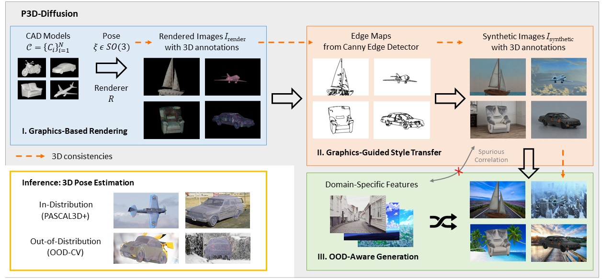

# Robust Category-Level 3D Pose Estimation from Diffusion-Enhanced Synthetic Data [WACV 2024]
PyTorch implementation for Robust Category-Level 3D Pose Estimation from Diffusion-Enhanced Synthetic Data.

<div align="center">
  
</div>

**Robust Category-Level 3D Pose Estimation from Diffusion-Enhanced Synthetic Data**

Jiahao Yang, Wufei Ma, Angtian Wang, Xiaoding Yuan, Alan Yuille, Adam Kortylewski

IEEE/CVF Winter Conference on Applications of Computer Vision (WACV) 2024

[[Paper]](https://openaccess.thecvf.com/content/WACV2024/html/Yang_Robust_Category-Level_3D_Pose_Estimation_From_Diffusion-Enhanced_Synthetic_Data_WACV_2024_paper.html)


## P3D-Diffusion Generation

### Install

Download [PASCAL3D+](https://cvgl.stanford.edu/projects/pascal3d.html) Dataset.

Download [ControlNet](https://github.com/lllyasviel/ControlNet) and merge the files into the existing `ControlNet` folder.

We use the pre-trained model [control_sd15_canny.pth](https://huggingface.co/lllyasviel/ControlNet/blob/main/models/control_sd15_canny.pth). Download and place it in `ControlNet/models`.

Download [Blender v2.79] (https://www.blender.org/download/releases/2-79/). Blender v2.80 and later are unlikely to be compatible.

Download the [Describable Texture Dataset (DTD)](https://www.robots.ox.ac.uk/~vgg/data/dtd/) into folder `data/dtd`.

Check that the file layout is as follows:

- **synthetic_3d/**
  - README.md
  - train/
  - test_pascal3d/
  - src/
  - PASCAL3D+_release1.1/
  - imgs/
  - generate_data/
  - experiments/
  - data/
  - create_model/
  - ControlNet/

### Render Images using Blender

See comments in  `generate_data/generate_p3d.sh`. 

```
cd generate_data
. generate_p3d.sh
```

### Obtain 3D Annotation

```
cd generate_data
. prepare_training_data.sh
```

### Style Transfer with ControlNet

```
cd ControlNet
. run_canny.sh
```

## Train Neural Mesh Model with Synthetic Images

```
cd train
. train.sh
```

## Unsupervised Domain Adaptation (UDA)

First inference on PASCAL3D+ training split to generate pseudo labels.

```
cd test_pascal3d
. generate_pseudo.sh
```

Then train the model using the pseudo labels.

```
cd train
. pseudo.sh
```

## Fine-tune with Real Annotations (optional)

Fine-tune the model with a portion of real annotations.

```
cd train
. fine_tune.sh
```

## Test on PASCAL3D+ Dataset

```
cd test_pascal3d
. test.sh
```

## Citation

Please cite the following paper if you find our work useful for your research.

```
@InProceedings{Yang_2024_WACV,
    author    = {Yang, Jiahao and Ma, Wufei and Wang, Angtian and Yuan, Xiaoding and Yuille, Alan and Kortylewski, Adam},
    title     = {Robust Category-Level 3D Pose Estimation From Diffusion-Enhanced Synthetic Data},
    booktitle = {Proceedings of the IEEE/CVF Winter Conference on Applications of Computer Vision (WACV)},
    month     = {January},
    year      = {2024},
    pages     = {3446-3455}
}
```
